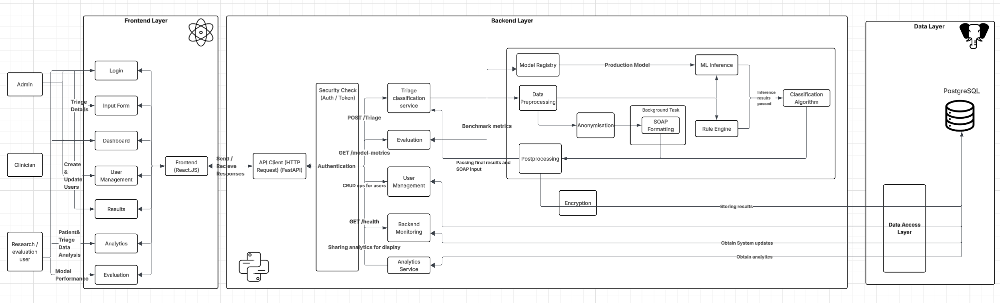
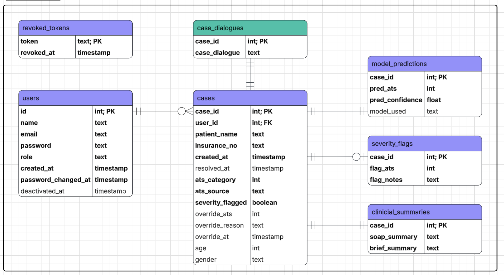
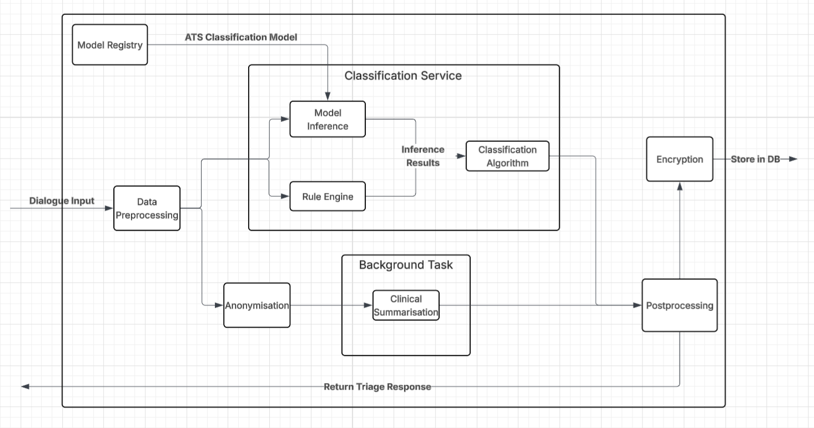

# TRIBOT AI Triage & Frontend Interface

This project contains a full-stack application using:

- React (TypeScript + Vite)
- FastAPI (Python)
- PostgreSQL
- Docker

### System Architecture


### Database Design


## Requirements

Install the following:

- Docker (https://docs.docker.com/get-docker/)

Verify installation:

```
docker --version
```

---

## Running the project for the first time

Clone the repository:

```
git clone https://github.com/unsw-cse-comp99-3900/capstone-project-26t1-9900-w18c-donut
```

Navigate into the project:

```
cd capstone-project-26t1-9900-w18c-donut
```

Start the application:

```
docker compose up --build
```

To start frontend development:

```
cd frontend/
yarn install
```

---

## Access the services

Frontend  
http://localhost:5173

Backend API  
http://localhost:8000

Backend API Docs  
http://localhost:8000/docs
or
see [API Documentation](backend/API_DOCUMENTATION.md)

PostgreSQL  
localhost:5432

---

## Stopping the project

Stop containers:

```
docker compose down
```

Remove containers and database volume:

```
docker compose down -v
```

---

## How It Works

Details on the algortihms and ML services can be found in [Tribot Services](backend/app/services/TRIBOT_SERVICES.md)

### ML Services


---

## Project Structure

`frontend/`
React TypeScript frontend

`backend/`
FastAPI server

`db/`
PostgreSQL initialization scripts

`docker-compose.yml`
Service orchestration

---

## Development Workflow

Start containers:

```
docker compose up
```

Edit code locally.

Changes automatically reload:

React uses Vite hot reload  

---

## Backend Testing

Run all tests - unit tests and integration tests:
```
docker compose exec backend pytest -v
```

Run all tests and see coverage
```
docker compose exec backend pytest --cov=app --cov-report=term-missing --cov-config=.coveragerc
```

See [Backend Test Report](backend/tests/BE_TEST_REPORT.md)

---

## Frontend Testing

Frontend tests live in `frontend/test/`, at the same level as `frontend/src/`:

- `frontend/test/components/` and `frontend/test/pages/` — Vitest + React Testing Library component tests.
- `frontend/test/e2e/` — Playwright end-to-end tests.
- `frontend/test/setup.ts` and `frontend/test/test-utils.tsx` — shared test setup and render helpers.

Install dependencies (first time only):

```
cd frontend
yarn install
```

Run component tests (Vitest):

```
yarn test        # watch mode
yarn test:run    # single run
```

Run end-to-end tests (Playwright):

```
yarn playwright install chromium   # first time only
yarn test:e2e
```

`yarn test:e2e` automatically starts the Vite dev server on `http://127.0.0.1:5173`, so the frontend container does not need to be running.

---

## Troubleshooting

Rebuild containers:

```
docker compose up --build
```

Reset database:

```
docker compose down -v
docker compose up --build
```