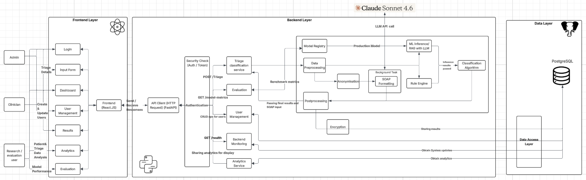

# TRIBOT AI-Assisted Clinical Triage Classification and Decision Support Interface

This project contains a full-stack application using:

- React (TypeScript + Vite)
- FastAPI (Python)
- PostgreSQL
- Docker

### System Architecture


### Database Design


## Requirements

Install the following:

- Docker (https://docs.docker.com/get-docker/)

Verify installation:

```
docker --version
```

---

## Running the project for the first time

1. Clone the repository:

```
git clone https://github.com/unsw-cse-comp99-3900/capstone-project-26t1-9900-w18c-donut
```

2. Navigate into the project:

```
cd capstone-project-26t1-9900-w18c-donut
```

3. Configure environment variables

Copy .env.example to .env and fill in your API keys:
```
cp .env.example .env
```
Required variables:
```
SECRET_KEY=your_secret_key
ENCRYPTION_KEY=your_encrytion_key

DB_HOST=your_db_host_name
DB_NAME=your_db_name
DB_USER=your_db_user
DB_PASSWORD=your_db_password

POSTGRES_USER=your_postgres_user
POSTGRES_PASSWORD=your_postgres_password
POSTGRES_DB=your_postgres_db_name

LLM_API_KEY=your_llm_api_key
```

4. Place necessary model(s) in relevant folder
- [Download deberta model](https://drive.google.com/file/d/1TIaPlBFxFNoYJ-Z4qeqnJkWv7ieJddc6/view?usp=drive_link)
- [Download setfit model](https://drive.google.com/file/d/1_lQJrk8fYz6p0BwRvxrh9mUoZdJP6qWY/view?usp=sharing)
- Place model content in respective directories under `backend/app/services/triage_classifier/models`. See [Backend Structure](BACKEND_STRUCTURE.md) for reference.

5. Start the application:

```
docker compose up --build
```

---

## Access the services

Frontend  
http://localhost:5173

Backend API  
http://localhost:8000

Backend API Docs  
http://localhost:8000/docs
or
see [API Documentation](backend/API_DOCUMENTATION.md)

PostgreSQL  
localhost:5432

---

## Stopping the project

Stop containers:

```
docker compose down
```

Remove containers and database volume:

```
docker compose down -v
```

---

## How It Works

### Features
- Triage Classification Engine
    - Clinical Dialogue Input Handling
    - Triage Classification Model
    - Rule-based Severity Flagging System
- Clinician Override
- Patient Data Anonymiastion
- Clinical Summarisation
- Clinician Dashboard
- Model Metric Breakdown

Details on the algortihms and ML services can be found in [Tribot Services](backend/app/services/TRIBOT_SERVICES.md)

### ML Services


---

## Project Structure

`frontend/`
React TypeScript frontend: See [Frontend Structure](FRONTEND_STRUCTURE.md)

`backend/`
FastAPI server: See [Backend Structure](BACKEND_STRUCTURE.md)

`db/`
PostgreSQL initialization scripts

`docker-compose.yml`
Service orchestration

`pipeline/`
Model training and data exploration

---

## Development Workflow

Start containers:

```
docker compose up
```

Edit code locally.

Changes automatically reload:

React uses Vite hot reload  

---

## Pipeline for Model Training

See [Pipeline details](pipeline/README.md)

---

## Backend Testing

Run all tests - unit tests and integration tests:
```
docker compose exec backend pytest -v
```

Run all tests and see coverage (78%)
```
docker compose exec backend pytest --cov=app --cov-report=term-missing --cov-config=.coveragerc
```

See [Backend Test Report](backend/tests/BE_TEST_REPORT.md)

---

## Frontend Testing

Frontend testing details are documented in:

- [Frontend Testing Guide](frontend/README.md)
- Coverage: Over 80% for Vitest and End to End

---

## Troubleshooting

Rebuild containers:

```
docker compose up --build
```

Reset database:

```
docker compose down -v
docker compose up --build
```

---

## Team

Capstone Project 26T1-9900-W18C-DONUT
- Rasheed Azeez
- Tony Nguyen
- Boqian Cao
- Ali Shan
- Gala Zhou
- Roshni Roy

---

## License

This project is for academic purposes.
