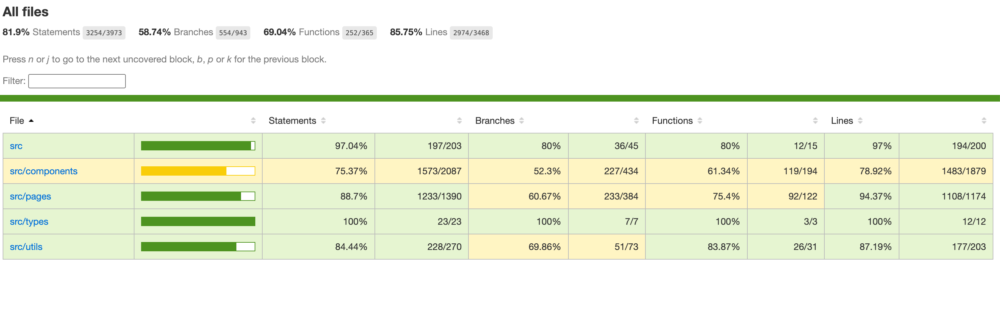

# Frontend Testing

This guide uses Docker as the primary way to run frontend tests for consistent environments.

## Test Structure

- `test/components/` and `test/pages/` - Vitest + React Testing Library tests
- `test/e2e/` - Playwright end-to-end tests
- `test/setup.ts` and `test/test-utils.tsx` - shared setup and helpers

## Docker Testing

Run in this order:

1) Start services:

```
docker compose up
```

2) Install Playwright browser binaries in the frontend container (first time only):

```
docker compose exec frontend yarn playwright install --with-deps chromium
```

3) Run unit/component tests:

```
docker compose exec frontend yarn test:run:docker
```

4) Run coverage:

```
docker compose exec frontend yarn test:coverage:docker
```

5) Run e2e:

```
docker compose exec frontend yarn test:e2e:docker
```

6) Run merged coverage (Vitest + Playwright e2e):

```
docker compose exec frontend yarn test:coverage:merged:docker
```

## Coverage Report

After `test:coverage:docker` (Vitest only) or `test:coverage:merged:docker` (Vitest + Playwright), coverage outputs are generated in:

- `frontend/coverage/`
- `frontend/coverage/lcov-report/index.html`

## Merge Unit + E2E Coverage

Run locally:

```
yarn test:coverage:merged
```

For Docker usage, reuse step 6 above.

This command:

- runs Vitest coverage and writes raw Istanbul JSON into `.nyc_output/`
- runs Playwright e2e with runtime instrumentation (`VITE_COVERAGE=true`)
- collects browser coverage from each e2e test into `.nyc_output/`
- merges everything with `nyc` and writes final reports to `coverage/`

Open the coverage report in your browser:

```
# macOS
open frontend/coverage/lcov-report/index.html

# Linux
xdg-open frontend/coverage/lcov-report/index.html

# Windows (PowerShell / CMD)
start frontend/coverage/lcov-report/index.html
```

### Frontend Test Coverage

